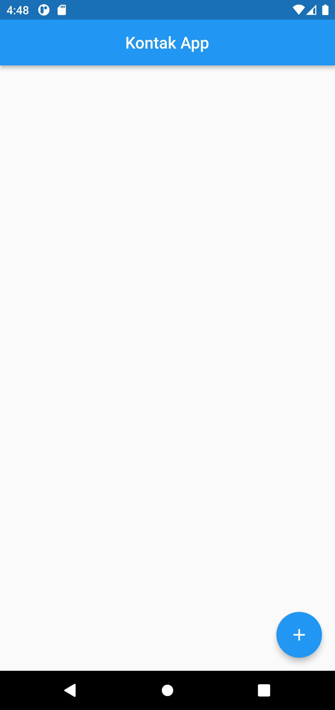
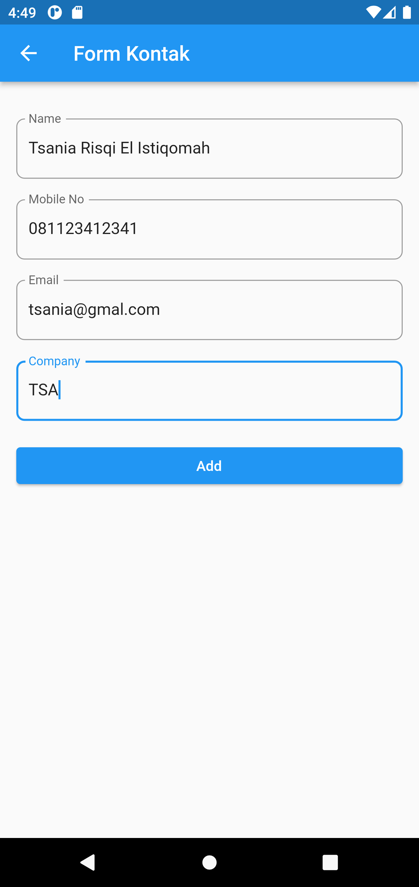
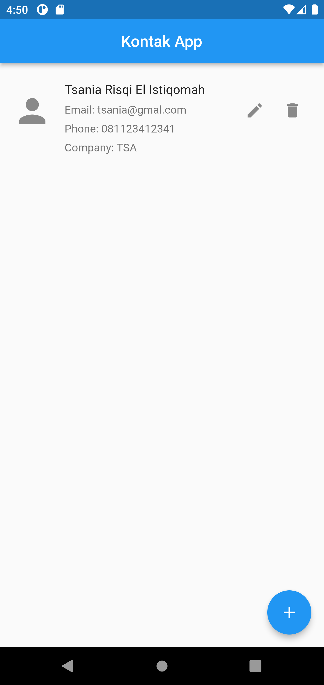
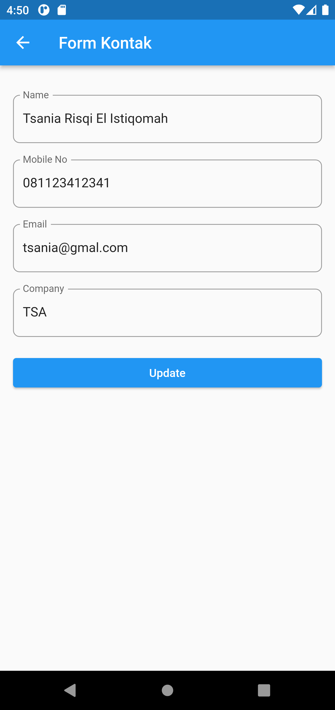
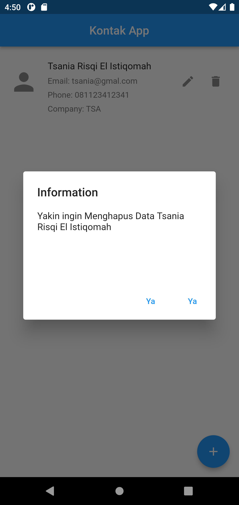

# aplikasi_kontak

A new Flutter project.

## Hasil 
| Result | Description |
| --- | --- |
|  | Halaman list kontak(awal): Pada halaman ini akan menampilkan list dari kontak yang telah ditambahkan. Ketika tidak ada data yang disimpan maka tampilannya akan kosong seperti gambar dibawah ini. Kemudian Untuk menambahkan kontak baru yaitu dengan cara menekan elevated button pada pojok kanan bawah. |
|  | Halaman list kontak(awal): Pada halaman ini akan menampilkan list dari kontak yang telah ditambahkan. Ketika tidak ada data yang disimpan maka tampilannya akan kosong seperti gambar dibawah ini. Kemudian Untuk menambahkan kontak baru yaitu dengan cara menekan elevated button pada pojok kanan bawah. |
|  | Halaman Form Kontak: Pada halaman ini berisikan form untuk menyimpan kontak. User dapat mengisikan informasi kontak pada halamn ini. Jika sudah selesai mengisikan form maka dapat menekan button Add. |
|  | Halaman list kontak: Ketika data kontak berhasil ditambahkan maka kontak tersebut akan ditampilkan pada halaman list kontak seperti gambar dibawah ini. Jika ingin melakukan edit data maka dapat menekan icon pensil. Dan jika ingin menghapus data dapat menekan icon tempat sampah. |
|  | Halaman edit kontak: Untuk mengedit data kontak dapat menekan icon pensil. Setelah itu edit data yang diinginkan, kemudian jika sudah selesai melakukan edit data dapat menekan button Update.  |
|  | Delete kontak: Untuk menghapus data kontak dapat menekan tombol tempat sampah. Setelah itu akan muncul dialog yang akan mengkonfirmasi apakah yakin untuk menghapus data tersebut. Tekan Ya untuk menghapus data, dan tidak untuk membatalkan. |